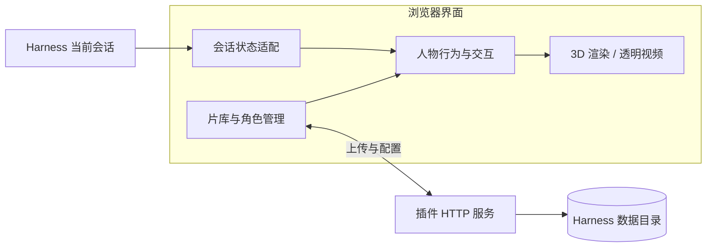

<a id="top"></a>

<div align="center">

<p>
  
</p>

<h1>Harness- docket</h1>

<p><strong>让人物陪伴工作，让会话拥有自己的开场。</strong></p>
<p>DeepSeek Harness Web 插件 · 人物伙伴 · 动作互动 · 会话片头</p>

<p>
  <a href="https://github.com/AngkinV/Harness--docket"></a>
  <a href="https://github.com/deepseek-ai/deepseek-harness"></a>
  <a href="https://nodejs.org/"></a>
  <a href="https://www.typescriptlang.org/"></a>
  <a href="LICENSE"></a>
</p>

<p>
  <a href="#install"><strong>快速安装</strong></a> ·
  <a href="#usage">使用指南</a> ·
  <a href="#features">功能介绍</a> ·
  <a href="#stack">技术栈</a> ·
  <a href="#faq">常见问题</a>
</p>
<p>
  简体中文 · <a href="README.en.md">English</a> ·
  <a href="https://github.com/AngkinV/Harness--docket/issues">反馈问题</a> ·
  <a href="#license">作者与许可</a>
</p>

</div>

---

Harness- docket 把可拖动、会行走的人物放进 Harness 页面：为人物配置模型、动作、表情和贴纸，让它响应当前会话的工作状态；上传自己的视频，为新会话设置开场画面。

**提问和任务在 Harness 主输入框完成，人物负责状态反馈与轻量互动。** 页面默认只展示一个人物，打开角色管理时切换为管理预览。

> [!NOTE]
> 公开版默认使用「蓝毛小女仆」，并附带 CC0 轻量 3D「小机器人」。首次安装内置四条会话片头；外部动作库为空，开发者的私人模型和 FBX 样本不随仓库分发。片头来源与各自许可边界见 NOTICE.md。基础人物的行走与互动无需另外下载模型。

<details>
<summary><strong>文档导航</strong></summary>

- [快速安装](#install) · [第一次使用](#usage)
- [功能介绍](#features) · [支持的资源](#resources)
- [技术栈与模块关系](#stack) · [数据与配置](#data)
- [开发指南](#develop) · [常见问题](#faq) · [项目信息与许可](#license)

</details>

<a id="install"></a>

## 快速安装

### 环境要求

| 项目 | 要求 |
| :--- | :--- |
| 运行环境 | 已安装并可正常启动的 DeepSeek Harness Web |
| Harness 版本 | `0.1.7-rc.2` 或更高，具体兼容性以宿主检查为准 |
| Node.js | 运行预编译插件需 `20+`；开发构建推荐 `24` |
| Git | 通过 GitHub 仓库地址安装时需可用 |
| 浏览器 | 3D 人物需要 WebGL；视频格式和语音能力取决于浏览器与系统 |

### 方式一：在插件管理中添加

1. 打开 Harness 的插件市场 / 插件管理，进入 **添加插件**。
2. 粘贴下方 GitHub 仓库地址并安装。
3. 按宿主提示重新加载；页面出现基础人物后，即可打开片库或角色管理。

```text
https://github.com/AngkinV/Harness--docket
```

### 方式二：使用命令行

```sh
dsh plugin --profile web add https://github.com/AngkinV/Harness--docket --ignore-scripts
```

仓库包含预编译 `lib/`、插件清单和界面资源。**使用者安装时无需构建插件，也无需安装插件的开发依赖。** 安装完成后重启正在运行的 Harness Web，或按宿主提示重新加载。

> [!TIP]
> 从旧 `dsh-boot-animation` 升级时，先确认新插件安装成功，再停用旧插件，避免重复挂载。通过仓库地址安装不等于已经收录到官方精选列表。

<a id="usage"></a>

## 第一次使用

| 想做的事 | 操作 |
| :--- | :--- |
| 移动人物 | 用鼠标或手指拖动；聚焦人物后也可用方向键移动 |
| 与人物互动 | 单击人物；拖动结束不会作为普通点击处理 |
| 展开或收起菜单 | 右键、人物旁 **···**、菜单键或 `Shift + F10`；按 `Esc` 收起 |
| 添加自己的模型 | **角色 → 上传模型 → 预览 → 使用此角色** |
| 配置动作与贴纸 | 在角色管理中打开动作 / 互动设置，选择资源并保存 |
| 设置会话片头 | **片库 → 上传视频 → 选择视频 → 预览**，再开启自动播放 |
| 恢复删除的视频 | 打开片库回收站，在保留期内选择恢复 |
| 调整播放提示朗读 | **角色 → 播放提示与声音** |
| 提问或执行任务 | 使用 Harness 主输入框，人物跟随当前会话状态 |

<a id="features"></a>

## 功能介绍

| 模块 | 可以做什么 |
| :--- | :--- |
| **人物伙伴** | 拖动定位、页面行走、记住位置与大小；支持鼠标、触摸与键盘操作 |
| **模型与预览** | 导入 VRM / GLB，检查模型与骨架，预览后再应用；支持改名和切换 |
| **动作与互动** | 导入 FBX、选择片段，绑定行走、待机或点击互动；组合表情、贴纸与短句 |
| **会话状态反馈** | 跟随当前会话的思考、工作、等待、完成和出错状态，支持配置对应互动 |
| **片头与片库** | 上传视频、查看封面、选择与预览；分别控制自动片头和当前会话重播 |
| **个性化设置** | 目光跟随、贴身菜单位置、互动组合、播放短提示和可选声音 |

### 人物与半圆菜单

人物平时在页面内活动；点击触发互动，拖动改变位置。右键或点击人物旁的 **···**，展开三个入口：**片头自动播放 → 片库 → 角色**。

对具有可控人形手臂的角色，菜单通过取物动作逐个展开，再排列为身旁的半圆。透明视频角色使用短动画展开；不具备相应骨骼的模型，以及开启「减少动态效果」的场景，直接显示最终菜单。

模型采用先预览、再应用的流程。加载失败会保留当前角色；打开菜单、管理面板、拖动或切到后台时，会按相应状态暂停人物移动。

### 动作、表情与目光

- **FBX 动作库**：优先适配 Mixamo 人形骨架，支持片段选择、预览、改名及行走 / 待机 / 互动绑定。
- **互动组合**：组合动作、模型实际提供的表情、PNG / WebP / GIF 贴纸和短句；按人物保存，支持复制与随机触发。
- **目光跟随**：提供关闭、轻柔和明显档位。具有相应眼骨或视线能力的 3D 人物可以跟随指针；透明视频没有独立眼骨控制。
- **状态反馈**：可为当前会话的不同工作状态选择互动。实际提问、模型调用与工具执行由 Harness 主会话管理。

### 会话片头与视频片库

片库提供视频上传、封面浏览、片源选择、预览与回收站。支持上传进度和取消，同名文件另存，避免覆盖已有资源。

**自动播放总开关**决定是否自动播放片头；**当前会话每次进入重播**是独立设置。关闭自动播放后仍可手动预览。片头静音播放，可通过右上角「跳过」直接进入会话。

删除的视频进入本地回收站，**30 天内可恢复**。恢复遇到重名文件时另存；超期资源由插件按清理规则处理。

### 透明角色与声音

可选的「蓝毛小女仆」包含 11 段透明动画，提供 WebM 与 HEVC Alpha MOV 两种格式。插件按浏览器能力选择格式并检查实际透明解码，失败会尝试备用格式。

切换片头自动播放时，页面右上方显示固定短提示。在 **角色 → 播放提示与声音** 中可开启朗读、选择声音、调整音量和试听。朗读默认关闭；声音来源、可用性及是否离线取决于浏览器和系统提供的语音服务。

<a id="resources"></a>

## 支持的资源

| 资源 | 格式 | 单文件上限 | 说明 |
| :--- | :--- | :--- | :--- |
| 人物模型 | VRM 0.x / 1.0、自包含 GLB | 50 MiB | 纹理须内嵌；模型能力决定可用骨骼与表情 |
| 外部动作 | FBX | 50 MiB | 优先支持 Mixamo 人形骨架；其他骨架可能需要重新映射或导出 |
| 表情贴纸 | PNG / WebP / GIF | 5 MiB | 图片尺寸不超过 2048 × 2048 |
| 片头视频 | MP4 / M4V / MOV / WebM / MKV | 250 MiB | 推荐 H.264 MP4；接受扩展名不等于浏览器支持其中所有编码 |
| 招呼语文件 | UTF-8 TXT / JSON 字符串数组 | 64 KiB | 每句最多 80 字；每个人物最多 12 个互动组合 |

动作与贴纸资源库合计最多 **100 个资源、512 MiB**。页面提示使用 MB / KB 标记，以上大小按代码中的 1024 进制列出。导入与预览通过后再应用；未知骨架或不支持的模型结构会给出错误提示。

<a id="stack"></a>

## 技术栈

| 层级 | 技术与版本 | 用途 |
| :--- | :--- | :--- |
| 宿主集成 | DeepSeek Harness / Cordis | 插件生命周期、Web UI 注入、会话状态与 HTTP 路由 |
| 界面 | React `18.x`、TypeScript `5.9.3`、CSS | 人物入口、片库、角色管理、响应式布局；React 由宿主提供 |
| 服务端 | Node.js `20+`、JavaScript ES Modules | 上传、文件校验、资源索引、持久化和回收站 |
| 3D 渲染 | Three.js `0.164.1` | WebGL 渲染、骨骼动画、相机与模型预览 |
| VRM 支持 | `@pixiv/three-vrm` `2.1.3` | VRM 模型、材质、表情与人形骨架 |
| 异步处理 | Web Workers / Node.js Worker Threads | 动作解析和资源校验任务 |
| 媒体与语音 | HTML Video、WebM、HEVC Alpha、Web Speech API | 片头播放、透明角色与可选系统朗读 |
| 构建 | esbuild `0.25.12`、TypeScript | 打包客户端 / 渲染器 / Worker，检查类型并生成分发内容 |
| 数据保存 | JSON 文件、原子写入、修订号与文件锁 | 保存配置，处理并发修改和恢复；无需另配数据库 |
| 发布检查 | Node.js 脚本、Git hooks、GitHub Actions | 白名单、敏感信息、历史检查与构建一致性验证 |

### 模块关系



客户端负责界面与人物呈现，宿主侧负责资源和配置。Three.js / VRM 渲染代码随插件打包，角色、动作和媒体按需加载；会话状态只驱动人物反馈。

<a id="data"></a>

## 数据与配置

数据保存在**运行 Harness 服务的机器**上。未设置 `DSH_HOME` 时，默认目录为 `~/.dsh`；远程部署时，上传文件保存到远端 Harness 服务的数据目录。

| 内容 | 保存位置 |
| :--- | :--- |
| 片头视频、片源选择与回收站 | `$DSH_HOME/boot-animation/` |
| 上传模型、模型名称与选择 | `$DSH_HOME/harness-docket/avatars/` |
| 动作、贴纸及按人物保存的互动设置 | `$DSH_HOME/harness-docket/companion/` |
| 人物位置、大小和声音偏好 | 浏览器本地存储，按 Harness 实例区分 |

备份时同时考虑服务端数据和浏览器偏好。人物插件不额外建立一套模型聊天入口；主会话的数据与模型配置由 Harness 管理。

<details>
<summary><strong>可选：从自己的目录读取模型和动作</strong></summary>

除界面上传外，可在启动服务时设置外部资源目录：

```sh
HARNESS_DOCKET_MODELS_DIR="/path/to/models" \
HARNESS_DOCKET_MOTIONS_DIR="/path/to/motions" \
dsh web
```

将示例路径替换为自己的绝对路径。未配置时，模型默认查找启动目录中的 `models/`；动作查找模型目录旁或启动目录中的 `motions/`，没有外部目录时使用包内清单。公开版包内动作清单为空。插件读取原文件，资源库配置与导入副本保存在 Harness 数据目录中。

</details>

<a id="develop"></a>

## 开发指南

以下命令在**公开仓库根目录**执行，推荐使用 Node.js 24：

```sh
git clone https://github.com/AngkinV/Harness--docket.git
cd Harness--docket
npm ci --legacy-peer-deps --ignore-scripts --no-audit --no-fund
npm run build
npm run typecheck
npm run check:public
```

| 命令 | 作用 |
| :--- | :--- |
| `npm run build` | 从源码、清单和素材生成完整 `lib/` |
| `npm run build:client` | 构建客户端、3D 渲染器与动作 Worker |
| `npm run typecheck` | TypeScript 类型检查 |
| `npm run check:public` | 检查当前公开文件与实际 npm 包，临时包和缓存自动清理 |
| `node release/check-public.mjs --git` | 额外检查完整公开 Git 历史 |

<details>
<summary><strong>公开仓库结构</strong></summary>

```text
Harness--docket/
├── src/                  # 宿主服务、资源管理和客户端源码
│   └── client/           # React 界面、人物行为与渲染
├── lib/                  # 安装即用的预编译产物
├── assets/pets/          # 透明角色素材、来源和校验清单
├── media/                # 四条片头构建输入与清单
├── motions/              # 动作构建清单，公开版默认空
├── locale/               # 中英文插件元数据
├── scripts/              # 构建与素材处理工具
├── release/              # 公开文件白名单和发布检查
├── docs/                 # 发布规则与资源预算
├── .githooks/            # 推送前检查
├── .github/workflows/    # 自动构建与发布检查
├── cordis.patch.yml      # Harness 插件挂载声明
└── package.json          # 入口、版本、依赖与打包配置
```

</details>

修改源码后，同步提交重建的 `lib/`。维护者克隆后执行 `git config core.hooksPath .githooks` 启用推送检查；新增公开文件需要审阅并更新逐文件白名单。安装流程不依赖 `prepare` / `install` / `postinstall` 等生命周期脚本。

构建完成后，可生成本地安装包：

```sh
npm pack --ignore-scripts --pack-destination ..
```

生成的 `.tgz` 可作为本地安装文件交给 `dsh plugin --profile web add`。包应留在仓库之外的交付目录，不能混入公开源码。

### 资源与发布约定

默认 3D 绘制最高 30fps、DPR 不超过 1.5；静态 3D 安静待机采用较低频率，后台停止装饰绘制。资源变化需要同时检查内存、媒体 / GPU 生命周期与磁盘开销，不能仅以功能测试通过代替性能验收。

这些是设计约束，**不代表所有设备均达到性能目标**。完整宿主的轻量 CPU 目标仍有已知未达项；大模型、预览及浏览器差异也会影响实际开销。修改与发布前请阅读 [资源预算](docs/resource-budget.md) 和 [发布与隐私规则](docs/public-release.md)。

<a id="faq"></a>

## 常见问题

<details>
<summary><strong>内置哪些片头，为什么没有 FBX 动作？</strong></summary>

0.9.2 内置 DeepSeek 品牌片头、赛博朋克片头、数字角色苏醒、光影·动色。视频保持源文件清晰度，其中光影·动色为4K/60fps，解码开销取决于设备。其作者/许可未核实，不属于代码BSD许可，详见 NOTICE.md。需要其他视频或外部动作时，可自行上传。基础人物自身的行走和互动可以直接使用。

</details>

<details>
<summary><strong>为什么人物没有独立聊天框？</strong></summary>

0.9.2 使用 Harness 主输入框完成对话和任务，人物展示当前会话状态。独立人物聊天已移除；若仍看到该入口，请核对安装版本，并在更新后重新加载宿主与页面。

</details>

<details>
<summary><strong>模型、动作或透明视频为什么无法使用？</strong></summary>

模型须满足自包含结构与内嵌纹理要求。FBX 优先适配 Mixamo 人形骨架，未知骨架可能需要在建模软件中重新映射；并非所有 GLB 都具备可绑定外部动作的人形骨架。透明视频还取决于浏览器和系统解码能力，两种格式都失败时会保留旧角色并提示错误。

</details>

<details>
<summary><strong>GitHub 地址安装较慢，是否卡住了？</strong></summary>

仓库包含透明角色媒体，首次下载需要一定时间。先查看 Harness 安装日志是否仍有下载进度，再检查当前代理和 Git 的代理配置是否一致。超时不代表插件无法加载；确认网络后重试即可，避免同时启动多个相同安装任务。

</details>

<details>
<summary><strong>如何反馈问题？</strong></summary>

到 [Issues](https://github.com/AngkinV/Harness--docket/issues) 提供插件 / Harness 版本、系统与浏览器、复现步骤、期望和实际结果。日志只保留与故障有关的片段，分享前移除令牌、Cookie、私人会话和个人路径；素材仅分享你有权公开的文件。

</details>

<a id="license"></a>

## 项目信息与许可

| 项目 | 信息 |
| :--- | :--- |
| 显示名称 / 包名 | **Harness- docket** / `harness-docket` |
| 本文对应源码版本 | `0.9.2`；实际安装版本以插件清单为准 |
| 维护者 | [AngkinV](https://github.com/AngkinV) |
| 代码仓库 | [AngkinV/Harness--docket](https://github.com/AngkinV/Harness--docket) |
| 代码许可 | [BSD-3-Clause](LICENSE) |
| 来源与第三方说明 | [NOTICE.md](NOTICE.md)、[渲染依赖许可](lib/third-party-licenses.txt) |
| 构建检查 | [GitHub Actions](https://github.com/AngkinV/Harness--docket/actions) |

### 致谢

- [NativeDog1/dsh-boot-animation](https://github.com/NativeDog1/dsh-boot-animation)：项目代码来源，保留原版权和许可。
- [PC2005-cloud/dsh-pet](https://github.com/PC2005-cloud/dsh-pet)：透明角色动画素材。
- [Three.js](https://threejs.org/) 与 [three-vrm](https://github.com/pixiv/three-vrm)：3D 渲染与 VRM 支持。

本项目为社区插件，不代表上游作者或 DeepSeek 官方背书。

> [!IMPORTANT]
> 「蓝毛小女仆」动画来自 [PC2005-cloud/dsh-pet](https://github.com/PC2005-cloud/dsh-pet)，**素材仅限非商用**，介绍、展示及分发须保留原作者 GitHub 地址。素材条款独立于代码的 BSD-3-Clause 许可，不能将代码许可理解为全部素材可商用。

<div align="center">

[返回顶部](#top)

</div>

0.9.2：自动播放开启时，页面启动即播放当前片头，早于宿主加载界面；上传复用流式校验结果，封面抽帧后释放解码器。默认使用蓝毛小女仆，附带 CC0 小机器人，移除旧内置星芽；三点菜单改为 1.18 秒的一次连贯取物。
